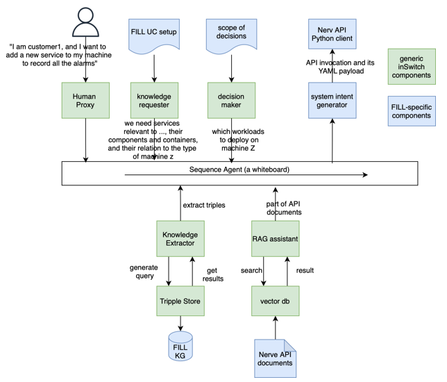
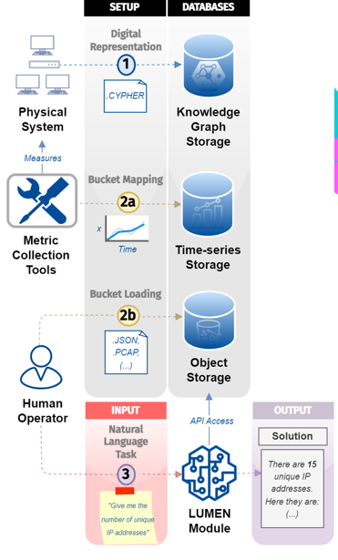

# inLUMEN (inSwitch + LUMEN)

Powered by

| Project Links |
| ------------- | 	
| Software GitHub Repository --> inSwitch software <https://github.com/songhui/inSwitch> |
| Software GitHub Repository --> LUMEN software (Note: part of digital twin) <https://github.com/SINTEF-9012/madt-neodash>| 
| Progress GitHub Project [ADD URL] |

## **General Description**

**inSwitch** = LLM agents for context switching from business-level intents to resource-level intents in the cognitive computing continuum. inSwitch makes informed decisions on which machine, which services, what workloads are needed for the service and which versions fit the machine based on context (knowledge).

**LUMEN** = Given a natural language query/request, provide digital twin operators with on-the-fly answers to questions about assets, real-time data flows or historical data by generating and executing analyzing code.

**inLUMEN** = DATAPACT tool combines the functionalities of inSwitch and LUMEN. When designing an AI/ML pipeline, one starts from simple intents and context. In DATAPACT, the **intent** translates to the pipeline goal. The context is the input data, code snippets, artifacts, constraints/rules, and list over available platforms/APIs. We let the user decide what’s relevant to achieve their goal, by allowing user-machine interaction to refine the pipeline design. Then, inLUMEN materializes their intents by generating code needed to containerize existing artifacts, and making the pipeline deployable by providing filled-in workflow blueprints (e.g. Argo Workflows). The process may be visualized by creating graph renditions of the envisioned pipeline.

## **Architecture**

[]
[]

## **Component Definition**
[]

## **Screenshots**
TODO

## **Commercial Information**

Table with the organisation, license nature (Open Source, Commercial ... ) and the license. Replace with the values of your module.

| Organisation (s) | License Nature | License |
| ---------------  | -------------- | ------- |

## **Top Features**

## **How To Install**

### Requirements

To be defined. 

### Software
n/a

### Summary of installation steps

Currently offered as a service at [add URL]. 

### Detailed steps

The custom version for DATAPACT is still under development.
The software is accessible at TODO:Add link

## **How To Use**

## **Other Information**

n/a

## **OpenAPI Specification**

n/a

## **Additional Links**

n/a
