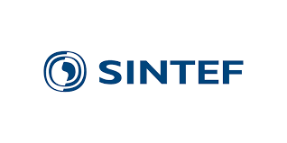
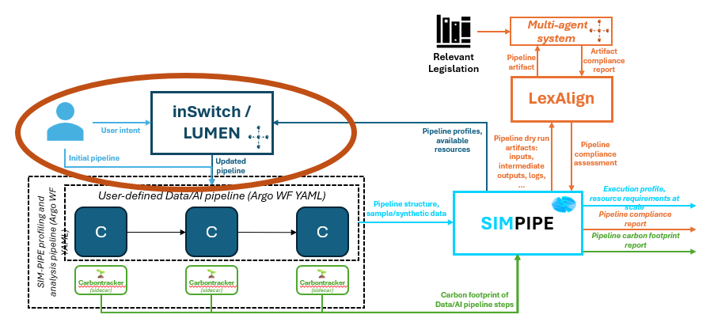
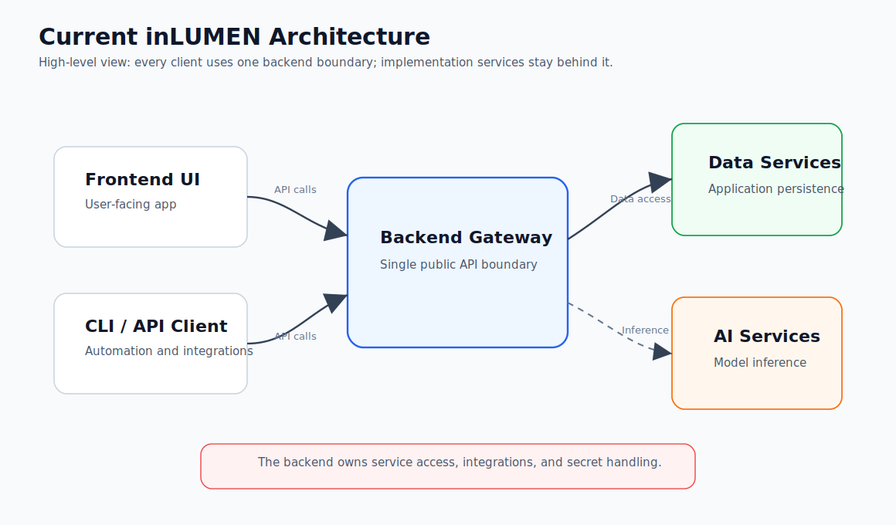
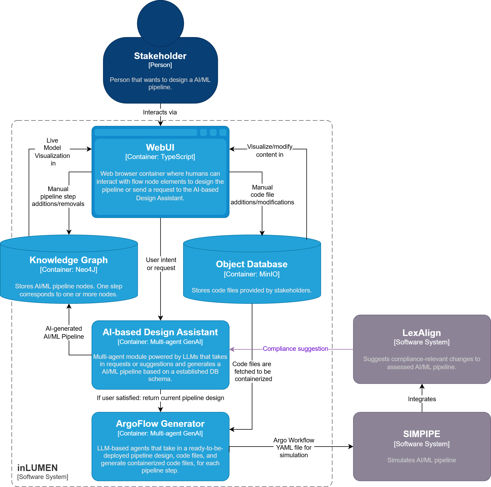
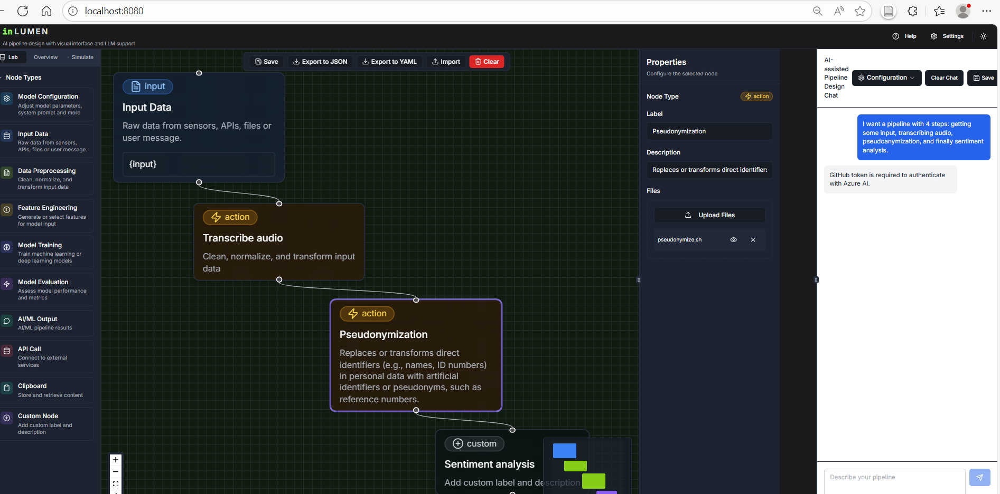

<div class="tool-header">
  <h1>inLUMEN: AI-assisted Pipeline Design Editor Tool</h1>
  <a href="https://www.sintef.no/">
    
  </a>
</div>


## **General Description**
**inLUMEN** is a DATAPACT tool that evolves traditional AI/ML/data pipeline design tools into AI agent-driven co-design environments. The story begins with simple visions (or intents) and context provided by the user.

In DATAPACT, the **intent** translates to the pipeline goal: both in terms of structure, use and compliance goals. The **context** is the input data, code snippets, artifacts, constraints/rules/requirements, and resources.

The user remains in control of the design, however supported by dedidated agents whose role is to make these visions come to life. inLUMEN materializes their intents by generating the pipeline steps as a directed graph, and gives recommandations on compliance-strengthening design choices.

Additionally, it generates deployment artifacts such as containers and workflow blueprints needed to simulate/run the pipeline. Provenance is given via tracking reports on decisions taken by the user and agents during the design process. 

## **Related Compliance aspects**
- Compliance by design
- Traceable decisions (provenance)​​

## **Main Goal/Functionalities**
- Co-design Intelligent Pipeline Design Editor (GUI with chat dialog window)
- Deployment Artifact Generation (Dockerfiles, YAML)
- Agentic AI Backend (agents assist with compliance-strenghtening design refinements)

## **Architecture**
The picture below shows the component in the DATAPACT architecture.




The current local deployment uses a simple gateway architecture. Frontend and CLI clients call only the backend gateway API; Neo4j, MinIO, and the OpenAI-compatible LLM provider remain behind the backend boundary.




## **Component Definition**
inLUMEN's core functionality is provided by LLM-powered agents that serve as helpful assistants in pipeline design, translating high-level business-level intents to pure AI/data pipeline design choices. inLUMEN agents reason on user intents and context, draw pipeline steps, and give recommandations according to compliance insights provided by the user or via tool integrations. They can also support deployment artitfact generation, making pipelines deployable. The chat dialog window enables human-machine interactions to co-design pipelines. inLUMEN integrates with external DATAPACT tools through public workflow and artifact APIs.

[]

## **Screenshots**
[]

## **Commercial Information**

| Organisation (s) | License Nature | License |
| SINTEF | Open Source | TBD |

## **Expected KPIs**

|What (types)|How(Process)|Values|
|------------|------------|------|
|Accuracy|	Benchmark on (partly synthetic) datasets by comparing agent-generated pipelines (Argo Workflows YAML format) to existing pipelines (Argo Workflows YAML format).| Cosine similarity >= 0.8|
|Usability| User Evaluation via Questionnaire about Usability/Ease of Use involving partners| Mean SUS score of at least 80 across representative participants from relevant use cases.|
|Deployment Success Rate|	Record response from deployment tools after providing deployment files. | >90% of generated pipeline designs executable|
|*Ability to perform compliance-by-design |*Modify non-compliant (mutated) pipelines so that they become compliant by providing legal analysis from LexAlign tool. Results validation done by human experts.|Expert-confirmed successful refinement for >90% of mutations.| 

(*combined with LexAlign mutation testing) 

## **Related Project Links**
| Project Links |
| ------------- | 	
| Software GitHub Repository --> MADT4BC/LUMEN software <https://github.com/SINTEF-9012/madt-neodash> |
| Software GitHub Repository --> inSwitch software <https://github.com/INTEND-Project/inSwitch> |

## **How To Install**
Tool is provided as a service.

### Detailed steps

Software Requirements:
1. [Docker Desktop](https://www.docker.com/%20products/docker-desktop/) installed. 
2. Node.js & npm installed - [install with nvm](https://github.com/nvm-sh/nvm#installing-and-updating)

The custom version for DATAPACT is still under development. To try the current stable version, follow the installation steps below:

Step 1: Clone this repository on your computer. 

Step 2: Navigate to the cloned project directory.

Step 3: Optional but recommended: copy `.env.example` to `.env` and adjust only the values you need.

The Docker setup derives CORS, frontend API URLs, Neo4J URI, and MinIO endpoint from the Compose service names, ports, and credential values, so you do not need separate `CORS_ALLOWED_ORIGIN`, `NEO4J_URI`, `MINIO_ENDPOINT`, `NEO4J_API_BASE_URL`, `MINIO_API_BASE_URL`, or `VITE_*_API_URL` entries for normal use.

Common values you may change include:
- `LLM_PROVIDER`, `LLM_BASE_URL`, `LLM_API_KEY`, and `LLM_MODEL` for OpenAI-compatible LLM services
- `FRONTEND_PORT`, `INLUMEN_API_PORT`, `MINIO_API_PORT`, `NEO4J_API_PORT`
- `NEO4J_HTTP_PORT`, `NEO4J_BOLT_PORT`, `MINIO_S3_PORT`, `MINIO_CONSOLE_PORT`
- `NEO4J_AUTH`, `MINIO_ROOT_USER`, `MINIO_ROOT_PASSWORD`
- `API_AUTH_TOKEN` for the gateway API and Swagger/OpenAPI documentation when Keycloak auth is disabled
- `AUTH_ENABLED` plus the Keycloak values when enabling authentication

For Keycloak SSO, set `AUTH_ENABLED=true` and configure `KEYCLOAK_JWKS_URL`, `KEYCLOAK_ISSUER`, and `KEYCLOAK_AUDIENCE` in the root `.env`. For a local Keycloak on port `8081`, the default frontend client values are `VITE_KEYCLOAK_URL=http://localhost:8081`, `VITE_KEYCLOAK_REALM=inlumen`, and `VITE_KEYCLOAK_CLIENT_ID=inlumen-frontend`. The same frontend still supports the embedded toolbox contract: when loaded in an iframe it waits for an `SSO_TOKEN` postMessage and infers the toolbox parent origin, so `VITE_TOOLBOX_ORIGIN` is not normally needed; it remains supported in `frontend/.env` only as a fallback for deployments that hide iframe referrers. Standalone frontend setups can also keep using `VITE_AUTH_ENABLED` and `VITE_INLUMEN_API_URL` in `frontend/.env`; Docker Compose derives those values from the root `.env` unless explicitly overridden.

Step 4: Run the following command to build the docker containers:
```
docker compose up --build
```

Step 5: Wait for the stack to finish starting. The root compose file now:
- starts Neo4J, MinIO, the backend gateway, and the frontend together
- builds the `backend` service from the Python source under `backend/`
- mounts the frontend and backend source folders for development
- keeps graph and object storage adapters inside the backend container instead of exposing them as Compose services
- connects the LLM agents to an OpenAI-compatible endpoint configured through `.env` or the UI
- is set up to behave consistently on macOS and Windows through Docker Desktop

Step 6: Configure an LLM provider. The default provider is OpenRouter:

```
LLM_PROVIDER=openrouter
LLM_BASE_URL=https://openrouter.ai/api/v1
LLM_API_KEY=sk-or-xxxx
LLM_MODEL=gpt-oss-120b
```

For OpenRouter BYOK, use your OpenRouter API key after adding the provider key in OpenRouter settings. Short model aliases such as `gpt-oss-120b` are accepted by inLUMEN and normalized before the request is sent.

You can also use Ollama Cloud with `LLM_PROVIDER=ollama_cloud`, `LLM_BASE_URL=https://ollama.com/v1`, `LLM_API_KEY=...`, and an Ollama Cloud model such as `gpt-oss:120b`. For a custom on-prem service, set `LLM_PROVIDER=custom`, `LLM_BASE_URL=https://your-host.example/v1`, `LLM_API_KEY=...`, and the model name exposed by that service. The UI configuration dialog supports the same OpenAI-compatible provider, base URL, API key, and model fields.

For the best macOS/Windows experience:
- use Docker Desktop with `docker compose`
- keep the repository on a local filesystem, not a network drive
- keep Git line endings as checked in; the repo now enforces LF for container-executed files

Note: building the containers may take around 5 minutes, please wait until Neo4J is fully started.  

Note: Once the installation is complete, the default local endpoints are localhost:8080 (frontend), localhost:5000 (inLUMEN backend gateway API), localhost:7474 (Neo4J HTTP), localhost:7687 (Neo4J Bolt), localhost:9000 (MinIO S3 API), and localhost:9099 (MinIO console). The backend also runs internal graph and object adapter modules on ports 5001 and 5003 inside the backend container; they are not frontend or CLI integration points. These defaults can all be changed through `.env`.

Note: To log into MinIO, use the configured root credentials from `.env`. For security reasons, change these values before using the stack outside local development.

## **How To Use**

To open the editor, go to `http://localhost:8080` by default, or the custom value you configured in `FRONTEND_PORT`. This will open the dashboard.

The frontend talks only to the inLUMEN backend gateway API on `INLUMEN_API_PORT`. That gateway owns graph and file orchestration through internal backend modules and keeps Neo4J and MinIO implementation details out of the browser and CLI contract. The frontend and CLI should use only `INLUMEN_API_PORT`.
LLM configuration metadata is also saved through the gateway by default (`VITE_ENABLE_REMOTE_CHATBOT_CONFIG_SYNC=true`); set it to `false` only for browser-local development overrides.

LLM agents use OpenAI-compatible Chat Completions endpoints. Configure OpenRouter, Ollama Cloud, or a custom on-prem endpoint in the dialog window or through the root `.env` file.

API key handling:
- Preferred deployment model: set `LLM_API_KEY` on the backend and do not enter provider keys in the browser.
- Optional BYOK model: a provider API key entered in the UI is kept in browser session storage only, sent to the backend only inside the specific LLM request payload, and is not saved by the backend `/api/chatbot-configs` endpoints.
- Do not run BYOK over plain HTTP outside local development; terminate TLS before the backend gateway in shared or production deployments.
- Backend logs intentionally report provider, model, and base URL but not the provider API key.

## **Gateway API and Swagger**

The gateway API is served by the inLUMEN backend API on `INLUMEN_API_PORT`, which is `5000` by default.

Required gateway API environment variable when `AUTH_ENABLED=false`:

```
API_AUTH_TOKEN=change-me-local-token
```

Local URLs:

- Swagger UI: `http://localhost:5000/docs`
- OpenAPI JSON schema: `http://localhost:5000/openapi.json`
- Health check: `http://localhost:5000/health`
- Readiness check: `http://localhost:5000/ready`

Swagger UI is enabled by default. Open `http://localhost:5000/docs`, enter a bearer token, then use the Swagger `Authorize` button or the pre-filled bearer auth to run live requests. The live schema documents both the integration-oriented `/api/v1/*` endpoints and the UI-equivalent gateway endpoints for canvas graph editing, file operations, pipeline version management, chat, and deployment artifact generation.

When `AUTH_ENABLED=false`, authentication uses a static bearer token:

```
Authorization: Bearer <API_AUTH_TOKEN>
```

When `AUTH_ENABLED=true`, authentication uses Keycloak access tokens:

```
Authorization: Bearer <KEYCLOAK_JWT>
```

The API validates Keycloak JWTs with `KEYCLOAK_JWKS_URL`, checks `KEYCLOAK_ISSUER` when configured, and accepts `KEYCLOAK_AUDIENCE` matches from the token `aud`, `azp`, or `client_id` claims. `/health` and `/ready` are public. The OpenAPI JSON and all `/api/v1/*` endpoints require the bearer token in static-token mode; UI-equivalent gateway endpoints require a valid Keycloak bearer token when `AUTH_ENABLED=true` and also accept the same header in local static-token mode. Invalid or missing tokens return `401` or `403`; validation errors return `400` or `422`; missing resources return `404`.

Example requests:

```
curl http://localhost:5000/health

curl -H "Authorization: Bearer $API_AUTH_TOKEN_OR_KEYCLOAK_JWT" \
  http://localhost:5000/openapi.json

curl -H "Authorization: Bearer $API_AUTH_TOKEN_OR_KEYCLOAK_JWT" \
  http://localhost:5000/api/v1/pipelines

curl -X POST http://localhost:5000/api/v1/pipelines \
  -H "Authorization: Bearer $API_AUTH_TOKEN_OR_KEYCLOAK_JWT" \
  -H "Content-Type: application/json" \
  -d '{"name":"Remote patient monitoring","description":"Integration-ready pipeline"}'

curl -H "Authorization: Bearer $API_AUTH_TOKEN_OR_KEYCLOAK_JWT" \
  "http://localhost:5000/api/v1/workflows?include_download_urls=true"

curl -H "Authorization: Bearer $API_AUTH_TOKEN_OR_KEYCLOAK_JWT" \
  http://localhost:5000/api/v1/pipelines/pipeline-123/artifacts/dockerfiles

curl -H "Authorization: Bearer $API_AUTH_TOKEN_OR_KEYCLOAK_JWT" \
  http://localhost:5000/api/v1/pipelines/pipeline-123/artifacts/argo-workflow.yaml

curl -X POST http://localhost:5000/api/graph/nodes \
  -H "Authorization: Bearer $API_AUTH_TOKEN_OR_KEYCLOAK_JWT" \
  -H "Content-Type: application/json" \
  -d '{"properties":{"flow_id":"retrieve","label":"Retrieve","type":"input","x":100,"y":120}}'

curl -X POST http://localhost:5000/simple_chat \
  -H "Authorization: Bearer $API_AUTH_TOKEN_OR_KEYCLOAK_JWT" \
  -H "Content-Type: application/json" \
  -d '{"user_message":"Add a retrieval step and connect it to processing","canvas_graph":{"nodes":[],"edges":[]}}'
```

Available gateway endpoint groups:

- `Pipelines`: create, list, fetch, and list versions for the current design pipeline
- `Artifacts`: generate Dockerfiles with the configured LLM, then assemble Argo Workflow YAML deterministically from the pipeline graph and Dockerfile metadata
- `Workflows`: list available workflow metadata, associated pipeline IDs, version metadata, and temporary MinIO signed access URLs when files are available
- `Canvas Graph`: replicate UI node and edge creation, deletion, property updates, and position changes through the gateway API
- `Pipeline State`: fetch the current graph, overview metadata, and saved UI pipeline versions
- `Files`: upload, remove, read, and update node-attached files without exposing MinIO credentials
- `Agentic`: call the same chat and artifact-generation operations available in the UI
- `Settings`: save and manage LLM configuration metadata through the gateway; provider API keys are session-only in the browser and are supplied per request
- `Health`: public liveness and readiness checks

The gateway API does not expose MinIO credentials. When file access is available through MinIO, responses contain temporary signed URLs only.

## **Other Information**

inLUMEN is still under development, any current users should expect unstable behaviour.

## **OpenAPI Specification**

The live OpenAPI 3 schema is available at `http://localhost:5000/openapi.json` with bearer authentication. The schema is the source used by Swagger UI at `http://localhost:5000/docs`.

## **Additional Links**

n/a
