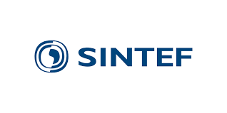
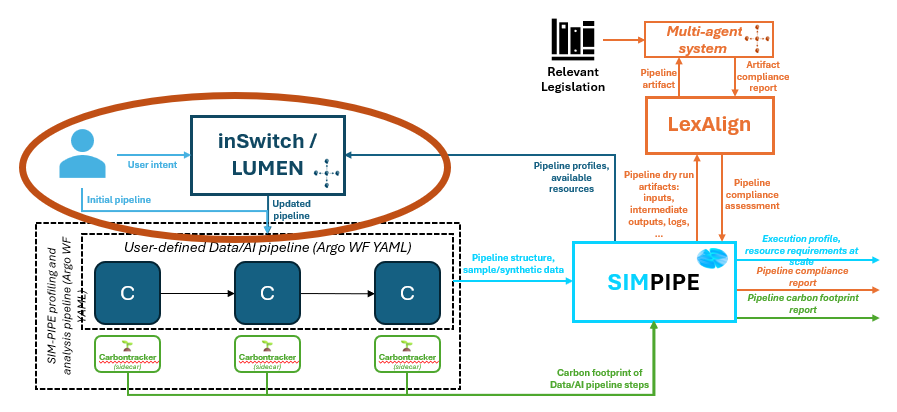
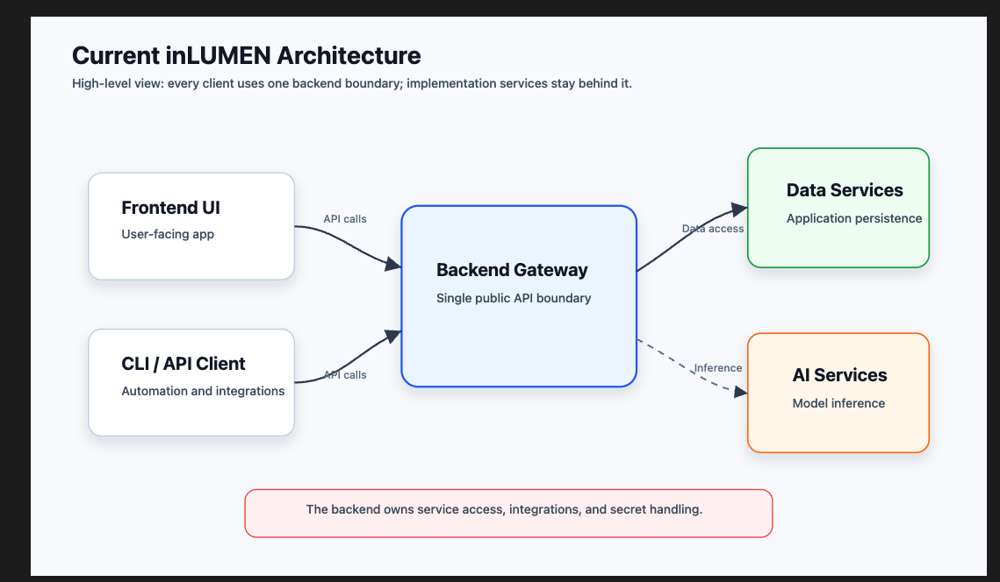
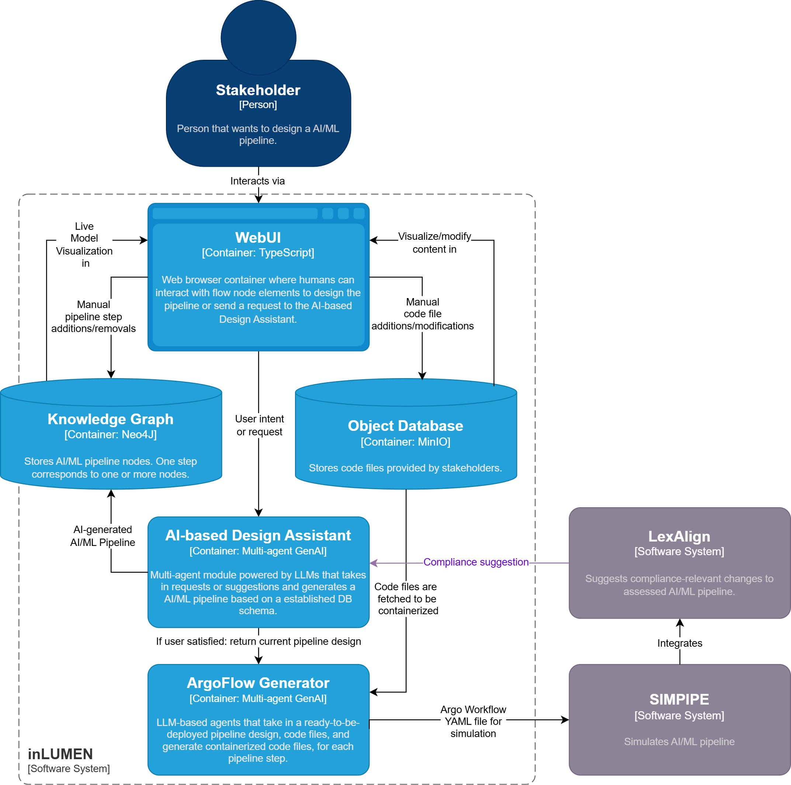
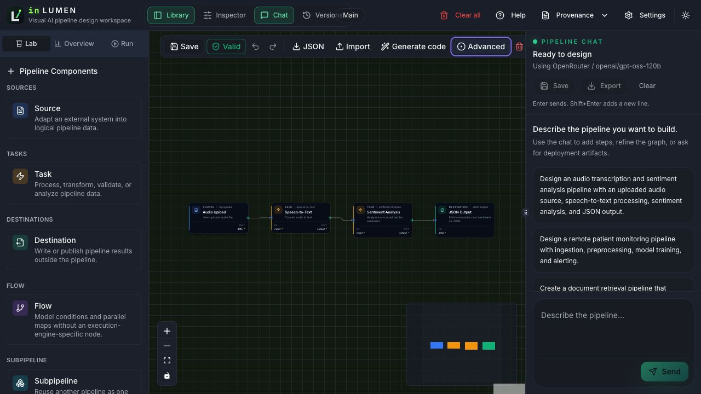

<div class="tool-header">
  <h1>inLUMEN: AI-assisted Pipeline Design Editor Tool</h1>
  <a href="https://www.sintef.no/">
    
  </a>
</div>


## **General Description**
**inLUMEN** is a DATAPACT tool that evolves traditional AI/ML/data pipeline design tools into AI agent-driven co-design environments. The story begins with simple visions (or intents) and context provided by the user.

In DATAPACT, the **intent** translates to the pipeline goal: both in terms of structure, use and compliance goals. The **context** is the input data, code snippets, artifacts, constraints/rules/requirements, and resources.

The user remains in control of the design, however supported by dedidated agents whose role is to make these visions come to life. inLUMEN materializes their intents by generating the pipeline steps as a directed graph, and gives recommandations on compliance-strengthening design choices.

Additionally, it generates deployment artifacts such as containers and workflow blueprints for external execution targets. inLUMEN designs, validates, and exports pipelines; it does not execute them. Provenance is given via tracking reports on decisions taken by the user and agents during the design process.

## **Related Compliance aspects**
- Compliance by design
- Traceable decisions (provenance)​​

## **Main Goal/Functionalities**
- Co-design Intelligent Pipeline Design Editor (GUI with chat dialog window)
- Deployment Artifact Generation (Dockerfiles, YAML)
- Agentic AI Backend (agents assist with compliance-strenghtening design refinements)

## **Pipeline component model**

The graph has exactly five structural node kinds. This small set is intended to
remain stable:

| Kind | Purpose |
| --- | --- |
| `source` | Adapt an external system into logical pipeline data. |
| `task` | Process, transform, validate, or analyze data. |
| `destination` | Write or publish results outside the pipeline. |
| `flow` | Model conditions and parallel maps. |
| `subpipeline` | Reuse another pipeline as one composable component. |

The initial Flow template catalog contains Condition and Parallel Map. Wait,
Retry, and Human Approval remain planned templates and do not require new graph
kinds when introduced.

### Using Flow components

A Flow component changes routing or scheduling; it does not transform the value.
New Flow components start as a Condition rather than as an ambiguous generic
node.

```text
Validate records -> Condition -> when_true  -> Train model
                              -> when_false -> Quarantine report
```

A Condition receives one `value`, evaluates its `expression`, and forwards the
value through exactly one named output. Expressions use `value` or a field path
and a literal comparison, for example `value.score >= 0.8` or
`value.status == "valid"`. The `when_true` branch is required; `when_false` is
optional when false values can be discarded.

```text
List documents -> Parallel Map (items -> item) -> Process one document
```

A Parallel Map receives an array through `items`. The branch connected to
`item` is scheduled once for each element. `max_concurrency` limits simultaneous
item runs, while `failure_policy` chooses whether one failed item stops the
remaining work or allows the other items to continue.

Definitions such as File, PostgreSQL, Data Cleaning, OCR, Speech-to-Text,
Embeddings, LLM, Report, or Kafka are templates built on these kinds; they are
not new graph types. The hierarchy is:

```text
Pipeline component -> Template -> Implementation
```

A task template can be implemented by Python (the default), SQL, a container,
an existing Git repository, REST API, shell, or a future runtime without changing
the graph. Generated code is another supported implementation source. Source and
destination templates are adapters: downstream tasks consume
logical values such as `Table`, `Stream<Message>`, or `Collection<Document>`
rather than depending on the external technology.

Every node stores explicit input and output ports. Compact canvas mode keeps port
contracts out of the way; Advanced mode shows their names and logical data types.
Static parameters belong in the node inspector and are never represented as
configuration nodes. Configuration is graph data only when another node produces
it dynamically through a port. Credential-like parameters such as API keys,
tokens, client secrets, and passwords are masked by default in the inspector;
each field can be marked secret and revealed locally with its eye control.

Legacy `input`, `action`, `sink`, `output`, `config`, `storage`, `api`, and `custom`
values are normalized at the persistence boundary into the five structural kinds
so existing saved graphs remain loadable.

The canonical Pipeline IR is JSON: nodes contain their structural kind, template,
implementation metadata, parameters, explicit ports, and project-file references;
edges identify both endpoint nodes and port IDs. This JSON contract drives version
storage, project import/export, agent context, and deployment generation. Executable
bundles add an engine-neutral `inlumen.run-spec@3`; the Dagster project (including
Docker Compose) and optional Argo Workflow are adapters derived from that contract.
YAML is not an internal representation and the canvas deliberately accepts
JSON project imports only; generated YAML remains export-only.

The current flat runtime schemas are published in
[`contracts/v3`](../contracts/v3/README.md); legacy schemas remain available in
[`contracts/v2`](../contracts/v2/README.md). The architecture, format choices,
compatibility rules, and current-surface inventory are recorded in [ADR
0001](./adr/0001-export-output-contracts.md).

## **Architecture**
The picture below shows the component in the DATAPACT architecture.




The current deployment uses a gateway architecture. Frontend and CLI/API clients call only the backend gateway API. The backend owns access to Neo4j and MinIO, brokers code generation and deployment validation through one private codegen service, and submits durable background lifecycle jobs to a private runner service. Configured OpenRouter, Ollama Cloud, or custom OpenAI-compatible LLM providers remain external services reached through the backend/codegen boundary.




## **Component Definition**
inLUMEN's core functionality is provided by LLM-powered agents that serve as helpful assistants in pipeline design, translating high-level business-level intents to pure AI/data pipeline design choices. inLUMEN agents reason on user intents and context, draw pipeline steps, and give recommandations according to compliance insights provided by the user or via tool integrations. They can also support deployment artitfact generation, making pipelines deployable. The chat dialog window enables human-machine interactions to co-design pipelines. inLUMEN integrates with external DATAPACT tools through public workflow and artifact APIs.



## **Screenshots**


## **Commercial Information**

| Organisation (s) | License Nature | License |
|------------------|----------------|---------|
| SINTEF | Open Source | [Apache License 2.0](../LICENSE) |

## **Expected KPIs**

|What (types)|How(Process)|Values|
|------------|------------|------|
|Accuracy|	Benchmark on (partly synthetic) datasets by comparing agent-generated pipelines (Argo Workflows YAML format) to existing pipelines (Argo Workflows YAML format).| Cosine similarity >= 0.8|
|Usability| User Evaluation via Questionnaire about Usability/Ease of Use involving partners| Mean SUS score of at least 80 across representative participants from relevant use cases.|
|Deployment Success Rate|	Record response from deployment tools after providing deployment files. | >90% of generated pipeline designs executable|
|*Ability to perform compliance-by-design |*Modify non-compliant (mutated) pipelines so that they become compliant by providing legal analysis from LexAlign tool. Results validation done by human experts.|Expert-confirmed successful refinement for >90% of mutations.| 

(*combined with LexAlign mutation testing) 

## **Related Project Links**
| Project Links |
| ------------- | 	
| Software GitHub Repository --> MADT4BC/LUMEN software <https://github.com/SINTEF-9012/madt-neodash> |
| Software GitHub Repository --> inSwitch software <https://github.com/INTEND-Project/inSwitch> |

## **Development and test suite**

The consolidated regression suite covers backend units and gateway APIs,
deployment bundle validation, frontend graph and configuration behavior,
frontend lint/type/build checks, and both Docker Compose configurations.

Install the test dependencies from the repository root:

```bash
# Python 3.11 or newer
python -m pip install -r requirements-test.txt
npm ci --prefix frontend
```

Run every check with one command:

```bash
python scripts/run_tests.py
```

During development, run a smaller part of the suite by selecting a component:

```bash
python scripts/run_tests.py --component backend
python scripts/run_tests.py --component codegen
python scripts/run_tests.py --component frontend
python scripts/run_tests.py --component compose
```

The same component checks run automatically for pushes to `main` and for pull
requests through GitHub Actions.

## **How To Install**
Tool is provided as a service.

### Detailed steps

Software Requirements:
1. [Docker Desktop](https://www.docker.com/%20products/docker-desktop/) installed. 
2. Node.js & npm installed - [install with nvm](https://github.com/nvm-sh/nvm#installing-and-updating)

The custom version for DATAPACT is still under development. To try the current stable version, follow the installation steps below:

Step 1: Clone this repository on your computer. 

Step 2: Navigate to the cloned project directory.

Step 3: Copy `.env.example` to `.env`, set the public backend URL, and replace the three token placeholders. Static-token authentication is enabled by default; uncomment the Keycloak block and set `AUTH_ENABLED=true` when deploying with Keycloak. The same `.env` file is used by both the development and production Compose stacks. Neo4J, MinIO, codegen, and runner routing remain private and use Compose-owned defaults.

The Docker setup derives frontend API URLs, Neo4J URI, and MinIO endpoint from the Compose service names, ports, and credential values, so you do not need separate `NEO4J_URI`, `MINIO_ENDPOINT`, or `VITE_*_API_URL` entries for normal local use. The backend sends permissive CORS headers by default.

The sample contains the public backend URL and API tokens, with Keycloak configuration ready as a commented optional block. Shared frontend/backend ports and development-only inspection ports are also included as commented overrides. Compose provides their defaults together with memory, Neo4J and MinIO credentials, internal service URLs, storage paths, timeouts, and development watchers.

The browser uses `INLUMEN_API_PUBLIC_URL`. The backend reaches codegen privately as `http://codegen:8010` and the runner as `http://runner:8020`, including when the Compose project runs on a VM behind Cloudflare; the frontend never calls either private service directly.

Set `AUTH_ENABLED=false` for local static-token authentication or keep it `true` for Keycloak. Advanced deployments can still override any Compose variable directly; for example, a separately hosted codegen service can set `INLUMEN_CODEGEN_SERVICE_URL`.

Step 4: Run the following command to build the docker containers:
```
docker compose up --build
```

The default `docker-compose.yml` is optimized for local development and exposes Neo4J and MinIO inspection ports. Neo4J is available at `localhost:7474` and `localhost:7687`; MinIO is available at `localhost:9000` with console access at `localhost:9099`. You can override those inspection ports with `NEO4J_HTTP_PORT`, `NEO4J_BOLT_PORT`, `MINIO_S3_PORT`, and `MINIO_CONSOLE_PORT`.

For deployment/production-like runs, use the production compose file. It exposes only the frontend and backend gateway on the host; Neo4J and MinIO stay private on the Compose network:

```
docker compose -f docker-compose-prod.yml up --build
```

For a deployment where the browser frontend calls a separately deployed backend URL, configure the root `.env` before building:

```
INLUMEN_API_PUBLIC_URL=https://api.inlumen.example.com
```

`INLUMEN_API_PUBLIC_URL` is passed to the Vite frontend as `VITE_INLUMEN_API_URL`, so browser requests go to the deployed backend instead of guessing from the frontend hostname. Use a full URL such as `https://api.inlumen.example.com`; for local testing, shorthand values such as `localhost:5001` are normalized with the current browser protocol.

You can verify the backend CORS preflight before opening the frontend:

```
curl -i -X OPTIONS "$INLUMEN_API_PUBLIC_URL/health" \
  -H "Origin: https://inlumen.example.com" \
  -H "Access-Control-Request-Method: GET"
```

The response should include `Access-Control-Allow-Origin: *`.

Step 5: Wait for the stack to finish starting. The root compose file now:
- starts Neo4J, MinIO, codegen, the background runner, the backend gateway, and the frontend together
- builds the `backend` service from the Python source under `backend/`
- mounts the frontend and backend source folders for development
- keeps graph and object storage logic inside the backend gateway instead of exposing adapter services
- connects the LLM agents to the OpenAI-compatible endpoint selected in the UI
- is set up to behave consistently on macOS and Windows through Docker Desktop

Step 6: Configure an LLM provider from the UI only if you use the Chat workspace. Code generation and deployment export do not use that provider, model, or API key.

### Code generation service

Code generation is included in this repository under `codegen/` and starts as
a private service with the root Compose stack. The browser never calls it
directly: inLUMEN creates a background job through the backend, and the backend
authenticates to `http://codegen:8010` over the internal Compose network.

Generation jobs and inLUMEN artifact-finalization metadata are stored in SQLite
databases on persistent volumes. A run therefore continues when its progress
panel is closed, can be rediscovered after a browser reload, and remains
inspectable after an application restart. Work that was executing during a
codegen-process restart is marked as interrupted and can be resumed from its
durable request snapshot.

Generation uses the dedicated code model selected in Settings. The design/chat
model remains independent. inLUMEN sends non-secret provider/model metadata in
the request and forwards the provider credential to codegen in an ephemeral
header; the credential is excluded from durable job snapshots. Generated code
is checked against reviewed task profiles, trusted adapters, package policy,
data contracts, and sandbox validation before it is persisted. The same private
service validates and optionally repairs generated Dagster and Argo deployment
bundles, so deployment validation requires no additional container or public
port.

Codegen remains independently deployable without frontend changes. Set:

```text
INLUMEN_CODEGEN_SERVICE_URL=https://codegen.example.com
INLUMEN_CODEGEN_SERVICE_API_KEY=<deployed service token>
```

Use HTTPS for any non-local endpoint. The service token authenticates inLUMEN
to codegen; the separately forwarded provider credential authenticates codegen
to the configured model endpoint.

The embedded SQLite job store is durable and appropriate for a single codegen
replica. A horizontally scaled deployment should replace it with a shared job
database and worker queue. Production sandbox execution should likewise use
isolated workers or cluster jobs rather than expose a host Docker socket beyond
the dedicated codegen service.

For OpenRouter, use your OpenRouter API key after adding the provider key in OpenRouter settings. The model fields provide live autocomplete, per-million input/output token pricing, and Cerebras availability. Selecting a Cerebras-hosted model pins that specific chat or code-generation request to the `cerebras` OpenRouter provider; a Cerebras BYOK key configured as prioritized in OpenRouter is then attempted before shared capacity. Short model aliases such as `gpt-oss-120b` are accepted by inLUMEN and normalized before the request is sent. OpenRouter response usage is accumulated across generation and repair calls, then shown as USD cost and token usage in the generation run dialog. Chat and code-generation requests are automatically attributed to inLUMEN using the project repository URL and `inLUMEN` title.

You can also use Ollama Cloud with base URL `https://ollama.com/v1` and an Ollama Cloud model such as `gpt-oss:120b`. For a custom on-prem service, select Custom / On premise and enter the OpenAI-compatible base URL, API key, and model name exposed by that service.

For the best macOS/Windows experience:
- use Docker Desktop with `docker compose`
- keep the repository on a local filesystem, not a network drive
- keep Git line endings as checked in; the repo now enforces LF for container-executed files

Note: building the containers may take around 5 minutes, please wait until Neo4J is fully started.  

Note: Once the installation is complete in dev mode, the local endpoints are localhost:8080 (frontend), localhost:5000 (inLUMEN backend gateway API), localhost:7474/7687 (Neo4J), and localhost:9000/9099 (MinIO). In production compose mode, only the frontend and backend gateway are exposed; Neo4J and MinIO stay private on the Compose network.

Note: To log into MinIO, use the configured root credentials from `.env`. For security reasons, change these values before using the stack outside local development.

## **How To Use**

To open the editor, go to `http://localhost:8080` by default, or the custom value you configured in `FRONTEND_PORT`. This will open the dashboard.

The frontend talks only to the inLUMEN backend gateway API on `INLUMEN_API_PORT`. That gateway owns graph and file orchestration through internal backend modules and keeps Neo4J and MinIO implementation details out of the browser and CLI contract. The frontend and CLI should use only `INLUMEN_API_PORT`.
LLM configuration metadata is also saved through the gateway by default (`VITE_ENABLE_REMOTE_CHATBOT_CONFIG_SYNC=true`); user-provided API keys remain browser-local and are never stored by the backend.

LLM agents use OpenAI-compatible Chat Completions endpoints. Configure OpenRouter, Ollama Cloud, or a custom on-prem endpoint in the Settings dialog. The backend rejects LLM requests that do not include a browser-supplied LLM configuration.

### Run Python pipelines and bring your own task scripts

Source and Destination components are boundary adapters managed by inLUMEN. A
File Source, for example, publishes the selected run input into the pipeline;
a Notification Destination captures or delivers the final result. They do not
ask the user for `main.py` and never require an LLM during export.

Only Task components have a **Runtime Package** section. The simple Python rule
is:

1. Attach `main.py`.
2. Attach `requirements.txt` only when the script needs third-party packages
   (`requirements.py` is not a Python dependency format).
3. Attach small repeatable data only as **Test Fixtures**.
4. Supply actual input files from the **Run** tab. Run inputs are ephemeral and
   replace fixtures for that execution; their filenames must match the root node
   contract.

inLUMEN runs every Task in a standard, flat workspace. Upstream files are
staged directly in `PIPELINE_INPUT_DIR`, and Task code writes downstream
artifacts directly to `PIPELINE_OUTPUT_DIR`. Port names are orchestration
metadata and never create implicit subdirectories. Artifact-owned relative
paths are preserved, and path collisions fail before execution. Source and
Destination implementations are platform-owned adapters.
The runtime inventories files after each process exits and moves them to the
next workspace internally, so the same Task package works locally, in Docker,
and in future distributed runners. Users upload only `main.py` and, when it is
needed, `requirements.txt`.

The **Generate Runtime Scripts** action reuses the high-level prompt that created
the pipeline. Users can either select **Generate and attach**, or select
**Copy prompt** and paste the ready-made request into any external AI. Both paths
produce the same simple node files. The external AI is asked to return code only;
input data always comes from the user. Its response includes a Run Input Map with
the exact filename and root consumer for each input. Bundle generation rejects
inputs that do not match the declared root contract.
Clearly malformed or placeholder inputs
(for example a text placeholder renamed to `.wav`) are rejected before a bundle
is generated.

Node scripts must be finite, non-interactive batch programs. The generated
Dagster runtime disables keyboard input and stops a node after 300 seconds by
default instead of leaving a run stuck indefinitely. Set
`INLUMEN_NODE_TIMEOUT_SECONDS` when starting the bundle to change that limit.

For registry-reviewed heavyweight models, exported Dagster bundles generate a
separate model-prefetch service. It acquires the pinned revision before the code
service starts, records a SHA-256 manifest in a persistent Docker volume, and
mounts that volume read-only for node execution. The isolated Dagster code
service then runs with Hugging Face and Transformers offline modes enabled, so a
pipeline run cannot stall on a model-hub download. Set `HF_TOKEN` in the shell
that launches `docker compose up`; it is used only by model prefetch.

The Run tab uses the durable background execution control plane described in
[ADR 0002](adr/0002-native-background-execution.md). Each run freezes the saved
graph, reviewed uploaded or AI-generated node packages, Source inputs, connector
runtimes, and Run Spec, then materializes that exact snapshot through Dagster in
a constrained one-off container. The tested snapshot and produced output files
remain downloadable from the run. A generated Dagster bundle runs with
`docker compose up --build` and exposes Dagster at
`http://localhost:3000`. Runs return `inlumen.run-result@1`, and materialized
output files are included under `outputs/` in the downloaded bundle. Argo is an
optional Kubernetes export. Its bundle builds
one content-addressed shared pipeline image from `argo/Dockerfile`; it does not
require an image per step unless incompatible dependency environments are split
explicitly in a future export.

Native runs use platform-managed resource profiles instead of user-facing CPU
or memory settings. Bundle metadata and implementation dependencies select a
`lightweight`, `standard`, or `ml_cpu` profile. The effective allocation is
bounded by host capacity, reserves room for inLUMEN and the operating system,
and is admitted through a FIFO queue. The Run tab displays the selected profile,
CPU, memory, and queue position while waiting, so a capacity wait is distinct
from a stalled pipeline.

The local runner accepts four outstanding runs. Further submissions receive a
structured `429 Too Many Requests` response until a run reaches a terminal
state; retrying the same idempotency key still returns the original run. This
bounds durable queue growth independently from the CPU/memory scheduler.

Terminal outcomes are persisted in Neo4j as concise, idempotent
`PIPELINE_RUN_SUMMARY` records linked to the captured pipeline and version. The
current pipeline also exposes its latest run status, duration, output count, and
snapshot digest. Full logs, events, secrets, bundles, and outputs remain in the
runner lifecycle and artifact stores.

The runner's embedded SQLite lifecycle store and separate filesystem artifact
store are durable for a single runner replica; bundle and output bytes are not
embedded in lifecycle rows. Production configures the Dagster adapter through the private codegen
execution service. A horizontally scaled runner must use a shared job store and
worker queue; user execution must never be placed in the gateway process.

API key handling:
- Provider API keys are entered only in the UI, kept in browser localStorage so they survive refreshes, browser restarts, and container restarts, sent to the backend only inside the specific LLM request payload, and are not saved by the backend `/api/chatbot-configs` endpoints.
- Do not run this browser-supplied key flow over plain HTTP outside local development; terminate TLS before the backend gateway in shared or production deployments.
- Backend logs intentionally report provider, model, and base URL but not the provider API key.

## **Gateway API and Swagger**

The gateway API is served by the inLUMEN backend API on `INLUMEN_API_PORT`, which is `5000` by default.

Required gateway API environment variable when `AUTH_ENABLED=false`:

```
API_AUTH_TOKEN=change-me-local-token
```

Local URLs:

- Swagger UI: `http://localhost:5000/docs`
- OpenAPI JSON schema: `http://localhost:5000/openapi.json`
- Health check: `http://localhost:5000/health`
- Readiness check: `http://localhost:5000/ready`

Swagger UI is enabled by default. Open `http://localhost:5000/docs`, enter a bearer token, then use the Swagger `Authorize` button or the pre-filled bearer auth to run live requests. The live schema documents both the integration-oriented `/api/v1/*` endpoints and the UI-equivalent gateway endpoints for canvas graph editing, file operations, pipeline version management, chat, and deployment artifact generation.

When `AUTH_ENABLED=false`, authentication uses a static bearer token:

```
Authorization: Bearer <API_AUTH_TOKEN>
```

When `AUTH_ENABLED=true`, authentication uses Keycloak access tokens:

```
Authorization: Bearer <KEYCLOAK_JWT>
```

The API validates Keycloak JWTs with `KEYCLOAK_JWKS_URL`, checks `KEYCLOAK_ISSUER` when configured, and accepts `KEYCLOAK_AUDIENCE` matches from the token `aud`, `azp`, or `client_id` claims. `/health` and `/ready` are public. The OpenAPI JSON and all `/api/v1/*` endpoints require the bearer token in static-token mode; UI-equivalent gateway endpoints require a valid Keycloak bearer token when `AUTH_ENABLED=true` and also accept the same header in local static-token mode. Invalid or missing tokens return `401` or `403`; validation errors return `400` or `422`; missing resources return `404`.

Example requests:

```
curl http://localhost:5000/health

curl -H "Authorization: Bearer $API_AUTH_TOKEN_OR_KEYCLOAK_JWT" \
  http://localhost:5000/openapi.json

curl -H "Authorization: Bearer $API_AUTH_TOKEN_OR_KEYCLOAK_JWT" \
  http://localhost:5000/api/v1/pipelines

curl -X POST http://localhost:5000/api/v1/pipelines \
  -H "Authorization: Bearer $API_AUTH_TOKEN_OR_KEYCLOAK_JWT" \
  -H "Content-Type: application/json" \
  -d '{"name":"Remote patient monitoring","description":"Integration-ready pipeline"}'

curl -H "Authorization: Bearer $API_AUTH_TOKEN_OR_KEYCLOAK_JWT" \
  "http://localhost:5000/api/v1/workflows?include_download_urls=true"

curl -H "Authorization: Bearer $API_AUTH_TOKEN_OR_KEYCLOAK_JWT" \
  http://localhost:5000/api/v1/pipelines/pipeline-123/artifacts/dockerfiles

curl -H "Authorization: Bearer $API_AUTH_TOKEN_OR_KEYCLOAK_JWT" \
  http://localhost:5000/api/v1/pipelines/pipeline-123/artifacts/argo-workflow.yaml

curl -X POST http://localhost:5000/api/graph/nodes \
  -H "Authorization: Bearer $API_AUTH_TOKEN_OR_KEYCLOAK_JWT" \
  -H "Content-Type: application/json" \
  -d '{"properties":{"flow_id":"retrieve","label":"Retrieve","type":"source","x":100,"y":120}}'

curl -X POST http://localhost:5000/simple_chat \
  -H "Authorization: Bearer $API_AUTH_TOKEN_OR_KEYCLOAK_JWT" \
  -H "Content-Type: application/json" \
  -d '{"user_message":"Add a retrieval step and connect it to processing","canvas_graph":{"nodes":[],"edges":[]}}'
```

Available gateway endpoint groups:

- `Pipelines`: create, list, fetch, and list versions for the current design pipeline
- `Artifacts`: generate the engine-neutral Run Spec, a runnable Dagster Docker Compose bundle, and an optional shared-image Argo Workflow export
- `Workflows`: list available workflow metadata, associated pipeline IDs, version metadata, and temporary MinIO signed access URLs when files are available
- `Canvas Graph`: replicate UI node and edge creation, deletion, property updates, and position changes through the gateway API
- `Pipeline State`: fetch the current graph, overview metadata, and saved UI pipeline versions
- `Pipeline Runs`: submit, list, inspect, cancel, and read incremental events for durable background runs
- `Files`: upload, remove, read, and update node-attached files without exposing MinIO credentials
- `Agentic`: call the same chat and artifact-generation operations available in the UI
- `Settings`: save and manage LLM configurations; provider API keys are browser-local and are supplied per request
- `Health`: public liveness and readiness checks

The gateway API does not expose MinIO credentials. When file access is available through MinIO, responses contain temporary signed URLs only.

## **Other Information**

inLUMEN is still under development, any current users should expect unstable behaviour.

## **OpenAPI Specification**

The live OpenAPI 3 schema is available at `http://localhost:5000/openapi.json` with bearer authentication. The schema is the source used by Swagger UI at `http://localhost:5000/docs`.

## **Additional Links**

n/a
