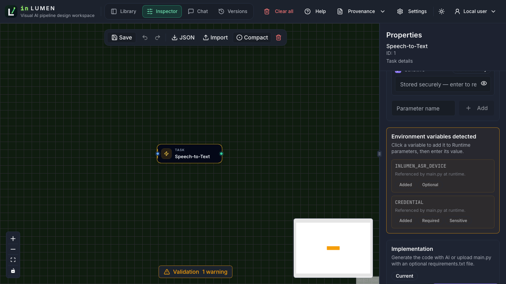
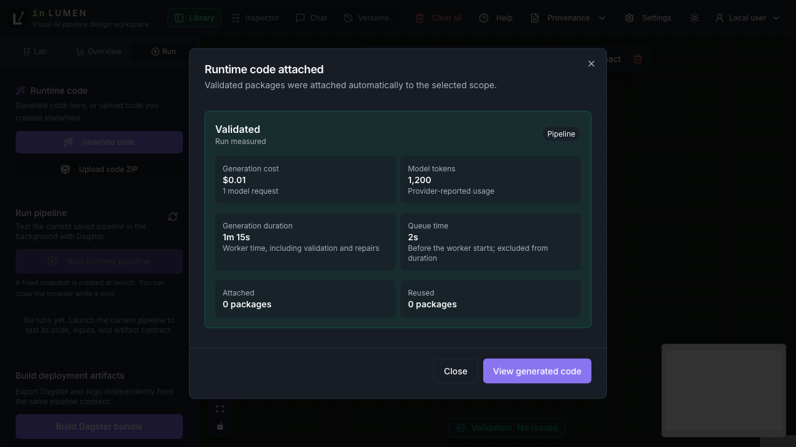

# Beta 4 implementation verification

Date: 2026-09-14. Implementation commit:
`e5b1290a11e47eb21ccc465ffdd8914b2fe0bb68`. These checks ran against the
working tree committed at that revision. Later documentation changes do not alter
runtime behavior. Follow-up `9270d2a766bd303b9c5539d41ab289e041d12247` makes
completed timing immutable even across delayed progress callbacks. Its lifecycle
regression file passed all 12 tests. The earlier browser/export/restart records
remain baseline evidence; CI evaluates the final PR head. Final release acceptance
still needs a named candidate and CI.

## Results

- Backend: 330 tests, 10 environment-dependent skips, passed in an isolated backend
  image with the repository mounted and no network. The added test preserves timing
  through the gateway snapshot and a reopened durable history store.
- Codegen: 131 passed, 4 environment-dependent skips. Lifecycle coverage verifies
  valid/invalid/failed/cancelled timing, queued cancellation, historical missing data,
  interrupted work, retries with fresh timing, and cache hits. The lifecycle file
  was repeated after its retry/cache assertions were added: 12 passed.
- Frontend: 165 unit tests, typecheck, production build and lint passed; lint has
  seven existing Fast Refresh warnings. Dependency audit: no vulnerabilities.
- Browser: the existing 18 browser checks and the new parameter test passed in the
  full run. After correcting the duration test's Library-toggle navigation, both
  Beta 4 browser checks passed together. These tests use controlled API fixtures;
  they are not an end-to-end deployment or real identity-provider check.
- Runner: 21 tests passed. Shared-file consistency and both Compose configurations
  passed (production configuration uses test-only validation environment values).
- An isolated codegen HTTP service created a real deterministic background job,
  persisted it, stopped, and restarted against the same SQLite database. All timing
  fields were unchanged: [before/after record](evidence/beta4-2026-09-14/generation-restart.json).
  This checks completed history, not a live provider or PostgreSQL restart.
- The supplied-code order-summary bundle executed successfully in a real Dagster
  container, producing 3 orders totaling 49.75 in both outputs:
  [result](evidence/beta4-2026-09-14/quickstart.json). This uses local fixture input
  to construct the export, not a browser export/download round trip.

## Browser acceptance

#99: keyboard-activate a detected variable, focus its empty value, fill it, and
observe Added. Add a variable flagged sensitive by discovery (without relying on
its name), enter its value through secure storage, save and reload. The normal
value remains; the sensitive value stays blank with Stored securely status. Graph
writes never contain the sensitive value. Unit coverage also removes a parameter
and verifies the suggestion becomes available again.

#100: open a completed job from recent history, see 1m 15s generation duration and
2s queue time beside its cost/tokens, reload the page, and retrieve the same job.
Values come from the job API, not a browser timer or mutable updated_at.

## Release boundary

No new upgrade, production deployment, identity-provider, concurrency or model
quality claim is made. Final CI, integration checks and release packaging must be
assessed on the accepted candidate. See the [release plan](../release-plan.md).
